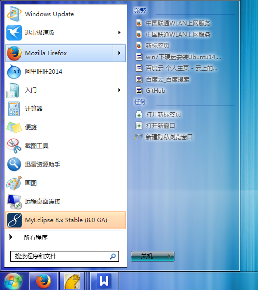
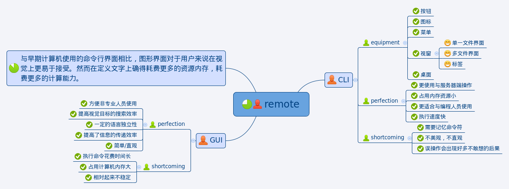
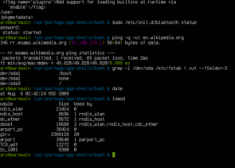

#GUI with CLI

###一.简介（*GUI*）
* 图形用户界面（Graphical User Interface，简称GUI）
  是指采用图形方式显示的计算机操作用户界面。与早期计算机使用
  的命令行界面相比，图形界面对于用户来说在视觉上更易于接受。
  但是如果要显示显示屏上的某一个像素点时，它就得比简单的文字
  表达画上更多的计算能力。

  

###二.特点
* GUI的广泛应用是当今计算机发展的重大成就之一，它极大地
  方便了非专业用户的使用。人们从此不再需要死记硬背大量的
  命令，取而代之的是可以通过窗口、菜单、按键等方式来方便地进行操作。
  而嵌入式GUI具有下面几个方面的基本要求：轻型、占用资源少、
  高性能、高可靠性、便于移植、可配置等特点。

###三. 组成部分
* 桌面、视窗、单一文件界面、多文件界面、标签、菜单、图标、按钮。

###一.简介（*CLI*）
* 命令行界面（英语：command-line interface，缩写：CLI）
  是在图形用户界面得到普及之前使用最为广泛的用户界面，
   它不支持鼠标操作，而是通过键盘向计算机传达指令，也有人称之为字符用户界面（CUI）。
  通常认为，命令行界面（CLI）没有图形用户界面（GUI）那么方便用户
  操作。因为，命令行界面的软件通常需要用户记忆操作的命令，但是，
  由于其本身的特点，命令行界面要较图形用户界面节约计算机系统的资源。
  在熟记命令的前提下，使用命令行界面往往要较使用图形用户界面的操作
    速度要快。所以，在现在的图形用户界面的操作系统中，通常都保留着可选的命令行界面。

    

* 虽然现在许多计算机系统都提供了图形化的操作方式，但是却都没有因而
  停止提供文字模式的命令行操作方式，相反的，许多系统反而更加强这部份的功能，
  例如Windows就不只加强了操作命令的功能和数量，也一直在改善Shell Programming的方式。
   而之所以要加强、改善，自然是因为不够好；操作系统的图形化操作方式对单一客户端计算机的操作，
  已经相当方便，但如果是一群客户端计算机，或者是24小时运作的服务器计算机，
  图形化操作方式有时会力有未逮，所以需要不断增强命令行界面的脚本语
  言和宏语言来提供丰富的控制与自动化的系统管理能力，例如Linux系统的Bash或是Windows系统的
  Windows Powershell。
